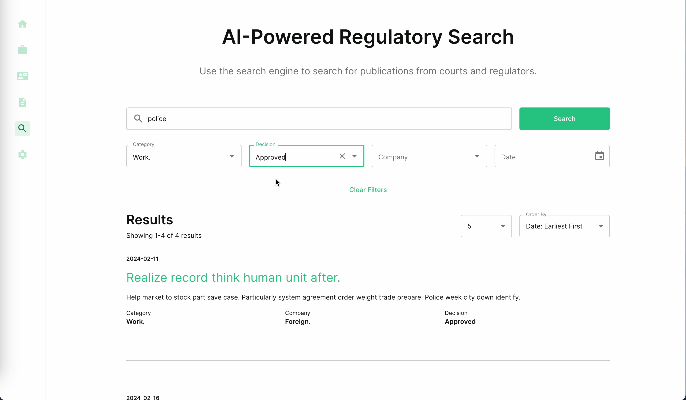

# Full Stack interview task

Search page with paginated list of results and filters. Made to showcase my skills in full-stack development.

## Task

For this stage, we have a take-home task that consists of implementing a simple landing page based on the design
provided in Figma. You can find the design link below.

- Implement the frontend using React.js, ensuring it matches the design provided in Figma.
- Develop a simple API endpoint using FastAPI, SQLAlchemy, and PostgreSQL.
- Your approach should follow common software engineering practices to ensure production readiness.
- Note: You don't need to implement logic for all buttons (like sidebar, footer, etc.); placeholders that do nothing
  when clicked suffice. The focus should be on implementing the paginated list of results and filters as seen in the
  design.

PDF version of the design: [Test Assignment 2024.pdf](https://github.com/ADR-007/courtcorrect-interview/files/14331893/Test.Assignment.2024.pdf)


## Implementation

- Backend
    - Stack
        - PostgreSQL
        - SQLAlchemy V2 (async)
        - Alembic
        - FastAPI
        - FastAPI-filters
        - FastAPI-pagination
        - FactoryBoy
        - Pytest
        - Docker
    - Features
        - Basic endpoint to fetch a paginated list of results with filters
- Frontend
    - Stack
        - TypeScript
        - Material-UI
        - React
        - React-query
        - openapi-react-query-codegen
    - TBD:
      - Tests
    - Features
        - Search page with a paginated list of results

## Screen recording


[](https://github.com/ADR-007/courtcorrect-interview/assets/7348960/bf0f370b-afc6-4ba7-aa7a-f6643cd96c4e)


## How to run locally

### Pre-requisites:

- Docker and Docker Compose
- Make

### Run all and populate the database

```bash
make run-all
```

### Destroy all containers and volumes

```bash
make destroy-all
```
